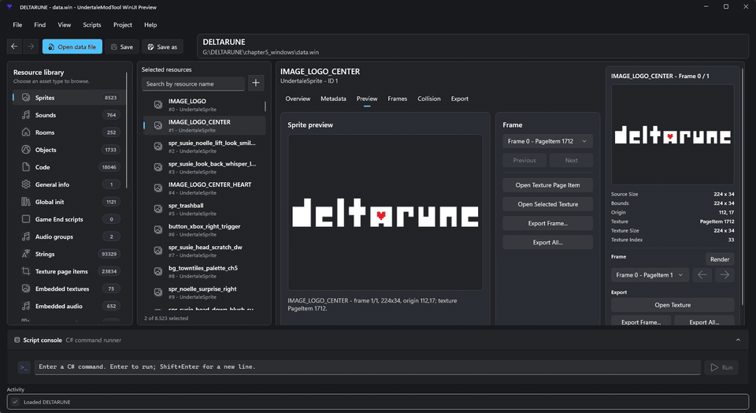
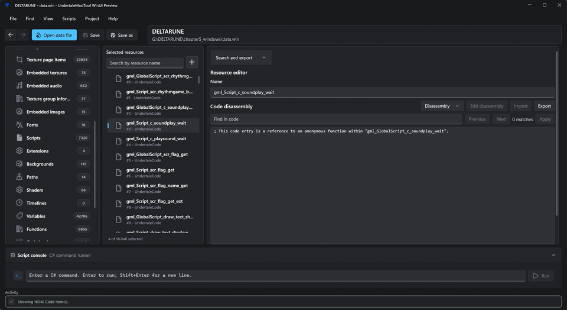
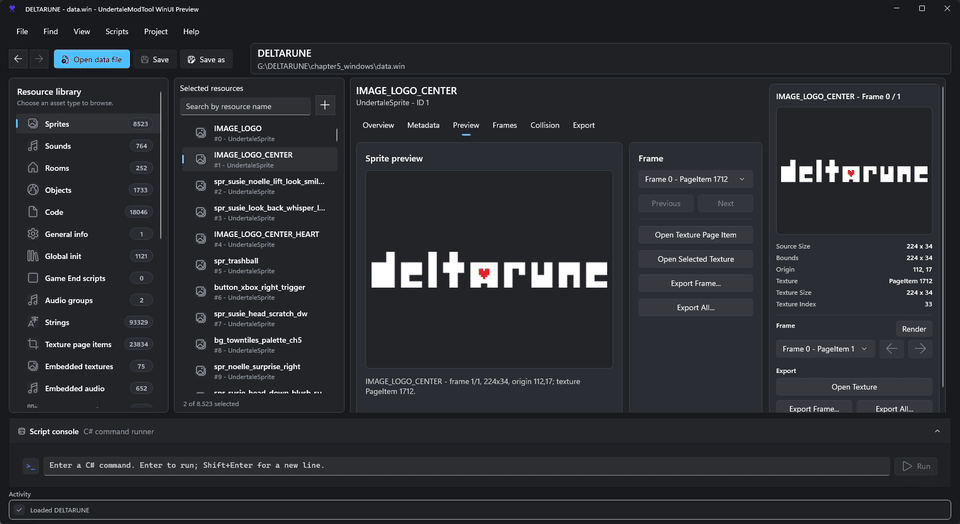

# UndertaleModTool WinUI Preview

An experimental WinUI 3 frontend for [UndertaleModTool](https://github.com/UnderminersTeam/UndertaleModTool), focused on exploring a cleaner, more modern Windows editing experience for GameMaker data files.

> [!IMPORTANT]
> **The WinUI 3 frontend is an experiment, not the planned long-term replacement for upstream UndertaleModTool.**
>
> Heavy feature development is not currently planned. Maintenance will focus mainly on **bug fixes, stability, compatibility, and critical regressions**. Future architectural work may explore a separate cross-platform direction.

The original WPF application, UndertaleModLib, CLI, scripts, research, license, and contributor credits remain preserved in this fork.

## Why This Exists

UndertaleModTool is extremely capable, but its classic interface can be dense. This fork was created to test how its workflows could feel in a more modern Windows-native UI without forcing that direction onto the upstream project.

The experiment has been useful for exploring resource navigation, previews, editing workflows, performance, and the boundaries between the UI and UndertaleModLib.

## WinUI Preview Highlights

- WinUI 3 / Windows App SDK interface.
- Resource browsing with categories, counts, filtering, and tabs.
- Sprite, texture, font, audio, shader, code, and other resource inspection.
- Texture atlas interaction and richer media previews.
- Preview caching and less eager rendering for heavier resources.
- Script command support.
- Modernized spacing, navigation, selection, and empty states.
- Shared UndertaleModLib and Underanalyzer functionality from the main project.

## Screenshots

### Browse and preview resources

<p align="center">
  
</p>

### Inspect code and shaders

<p align="center">
  
</p>

### Quick tour

<p align="center">
  
</p>

## Maintenance Scope

This branch will remain available and maintained where reasonable, but its scope is intentionally limited.

Current priorities are:

1. Fix serious bugs and regressions.
2. Keep compatibility with relevant UndertaleModLib and GameMaker format changes where practical.
3. Preserve a usable and stable WinUI build.

Large new WinUI-specific systems or major UI expansions are not a priority.

## Relationship to Upstream

This repository is based on [UnderminersTeam/UndertaleModTool](https://github.com/UnderminersTeam/UndertaleModTool).

It is an independent fork and is **not maintained or endorsed by the Underminers team unless explicitly stated by them**.

Upstream remains the authoritative project for UndertaleModTool itself.

## Build From Source

Requirements:

- Windows 10 1809 or newer, or Windows 11.
- .NET 10 SDK or newer.
- Git submodules initialized.

```powershell
git clone --recurse-submodules https://github.com/cmdr-chara/UndertaleModTool.git
cd UndertaleModTool
git switch winui-preview
```

Run:

```powershell
dotnet run --project .\UndertaleModTool.WinUI\UndertaleModTool.WinUI.csproj -c Debug -p:LangVersion=latest
```

Build:

```powershell
dotnet build .\UndertaleModTool.WinUI\UndertaleModTool.WinUI.csproj -c Debug -p:LangVersion=latest
```

## Supported Data Files

The WinUI frontend can open supported GameMaker data files such as:

- `data.win`
- `game.ios`
- `game.unx`
- `game.droid`

**Always keep a backup of the original game data before saving modifications.**

## Repository Layout

- `UndertaleModTool.WinUI` — experimental WinUI 3 frontend.
- `UndertaleModTool` — original WPF frontend.
- `UndertaleModLib` — shared GameMaker data library.
- `UndertaleModCli` — command-line tooling.
- `Underanalyzer` — analysis/decompiler submodule.
- `UndertaleModTests` / `UndertaleModLibTests` — test projects.

For documentation about UndertaleModTool and GameMaker data formats, see the upstream [UndertaleModTool wiki](https://github.com/UnderminersTeam/UndertaleModTool/wiki).

## License

This fork preserves the upstream license. See [LICENSE.txt](LICENSE.txt).

## Credits

UndertaleModTool and the underlying research exist because of the work of the upstream project and its contributors:

- [UnderminersTeam/UndertaleModTool](https://github.com/UnderminersTeam/UndertaleModTool)
- [UndertaleModTool contributors](https://github.com/UnderminersTeam/UndertaleModTool/graphs/contributors)
- [PoroCYon's UNDERTALE decompilation research, maintained by Tomat](https://tomat.dev/undertale)
- [Donkeybonks's GameMaker data.win bytecode research](https://web.archive.org/web/20191126144953if_/https://github.com/donkeybonks/acolyte/wiki/Bytecode)
- [PoroCYon's Altar.NET](https://github.com/PoroCYon/Altar.NET)
- [WarlockD's GMdsam](https://github.com/WarlockD/GMdsam)
